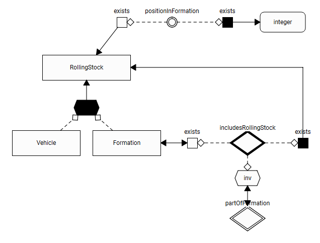
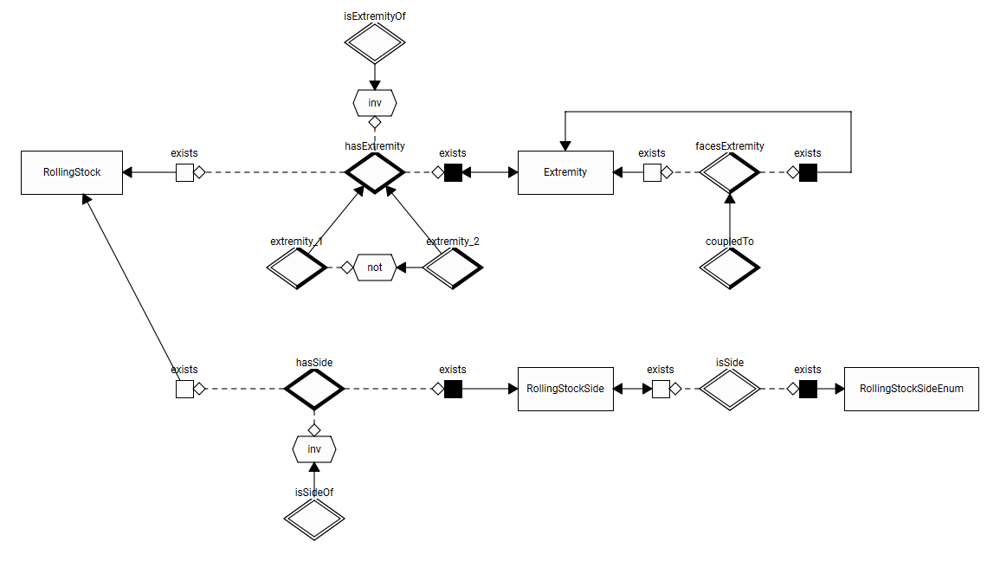
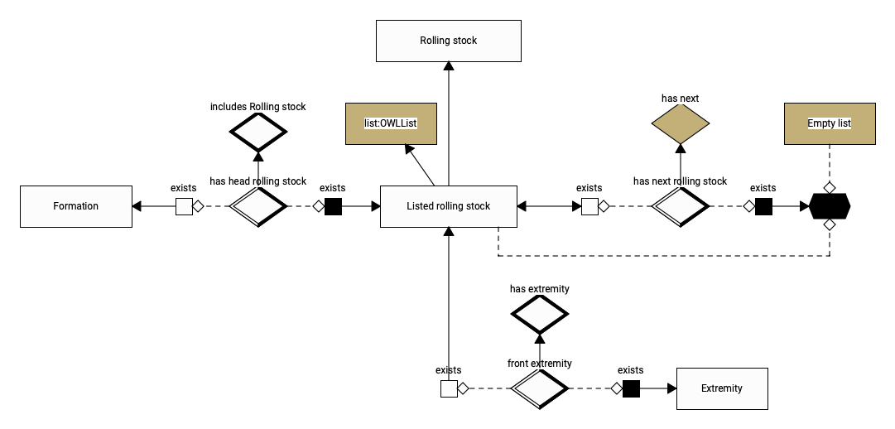

# CDM-RST compiled wiki pages

_Self-contained version with local images_


## Version

This document was generated on 2025-11-19 20:14:12 UTC


---
# Rolling stock consist

## Purpose

Represent rolling stock vehicles and formations, their parthood relationships, and the order and orientation of vehicles in a formation.

## Vehicles and formations

### Purpose

Simple distinction between a vehicle and a formation. A formation consists of vehicles or other formations. A formation that cannot be broken down further is called a "vehicle". The old debate is whether the breakdown can, or cannot be performed in operations. "It depends", not necessarily on the rolling stock, so the rolling stock ontology is neutral about it.

The main statement, under the ontology, is: if a piece of rolling stock cannot be broken down into other pieces of rolling stock, then it is a vehicle.

A TGV trainset or ICE3 for instance have trailers, but these will not be handled separately in operations (ICE case) and cannot even rest on rails (TGV trailers rest on 0 to 2 bogies), but are still considered "vehicles" by many, and for sure they cannot be further broken down into smaller pieces of rolling stock - only parts (carbodies, bogies, HVAC units, seats...).

### Diagram

The diagram illustrates a composite pattern (known from UML) which expresses that a formation may contain vehicles or other formations.

The flattened black hexagon is the GRAPHOL symbol for disjoint unions: hence the set of all rolling stock contains two disjoint subsets, vehicles and formations. A vehicle cannot be a formation, and conversely. A formation X can however contain a single vehicle Y, but X and Y remain distinct objects.



Property "part of formation" is functional (and it inverse "includes Rolling stock" is inverse functional): this means that a piece of rolling stock cannot be part of two formations. For reference, an OWL "functional property" has at most one object.

### Comments

#### More details about the representation of properties in GRAPHOL

The GRAPHOL diagram (and the OWL2 ontology) also expresses that a formation includes _at least_ one piece of rolling stock. The double arrow (equivalence) between class Formation and the small white box means exactly that. In detail:

* property "includes Rolling stock" has an extension, which is the set of pairs (a formation, a rolling stock) for which the property holds.
* the white box represents the set of formations for which the property holds
* the black box represents the set of rolling stock for which the property holds
* the double arrow means mutual inclusion, i.e. equivalence, so the extension of formation is equivalent to the set of formations that includes some (existential quantifier = at least one) rolling stock.
* this double arrow entails "every formation includes at least one rolling stock".
* please note that the RDFS domain semantics are different: ```cons:includesRollingStock rdfs:domain cons:Formation``` means:
  * "a formation _may include_ rolling stock"
  * the corresponding GRAPHOL representation would show a single arrow pointing from the white box into the Formation box (Formation is a super-set of the things that include rolling stock).

#### About handling of constraints

We generally use OWL2 constraints when they also carry some semantics. Here, having a container (formation) without contents (vehicles or other formations) is pretty much meaningless.

Constraints only dealing with data correctness are better represented as SHACL shapes. These can be checked, but do not interact with the semantics of the data representation.

In some cases, we move to SHACL such constraints that are semantically relevant but do not match the self-imposed limitations on OWL2 usage. For instance, an ETCS Balise Group consists of at most 7 balises, but the qualified cardinality restriction "at most 7" cannot be expressed in the OWL2 RL profile; the OWL2 DL profile at least is required.

## Extremities

### Purpose

All rolling stock is oriented on the drawing board. Extremities are usually designated "extremity 1", "extremity 2", and this distinction helps differentiating driving cabs on a locomotive, the placement of axles or loads, etc. independently from other information (e.g. running direction). Rolling stock orientation is conventional and may rest on standards: see for instance EN 13775-1.

### Diagram

The diagram illustrates two properties: hasExtremity ("a rolling stock has two extremities") and facesExtremity (on coupling, an extremity of a rolling stock faces the extremity of another rolling stock).



An extremity belongs to one wagon (it cannot be shared with another one), so "hasExtremity" is inverse functional.

Extremities of two adjacent wagons may face each other: this is expressed by "faces extremity", a symmetric property (if X1 faces Y2, then Y2 faces X1).

Once extremities are facing each other, one may consider coupling them; if they are coupled, they are obviously facing each other. This is exactly the meaning of "coupled to" being a subproperty of "faces extremity".

### Comments

#### About cardinalities, subproperties, and disjoint properties

Property hasExtremity should have a cardinality of exactly 2 (not available in OWL2 RL) and this cardinality is of little use anyway, since we need to identify extremity 1 and extremity 2 that will orient the rolling stock. These extremities are singled out by sub-properties of hasExtremity. These sub-properties are disjoint: by essence, extremity 2 of a wagon cannot be the same as extremity 1 of the same wagon. This is expressed by the "not" flattened hexagon in GRAPHOL, that tells that the set of (rolling stock, extremity) pairs satisfying "extremity_2" does not overlap the set of pairs satisfying "extremity_1". In set theory, Y does not overlap X iff Y is a subset of the complement of X (as the complement of X is the largest set not overlapping X).

## Formations as ordered sets

### Purpose

Sequences, vectors, arrays are not part of OWL2 syntax elements. To express order, one must use some List ontology expressed in OWL2. Here, we use the same List ontology also used by IfcOwl. It rests on the "linked list" paradigm, with each element of the list pointing to the next.

The list is invariably closed by an instance of EmptyList, a special class provided by the List ontology. This ensures that the list has actually come to an end.

_Note: given the underlying "Open World Assumption", we do not assume that data are complete, we only accept **positive information telling that it is complete**. Here, the fact that a list element does not point to any next element has no meaning. After all, the next element could simply be unknown and get discovered later. But if the list element points to an "empty list", this positively tells that the list has come to an end._

### Diagram

The first diagram showed that a formation includes some (= at least one) rolling stock. The diagram below expresses, on the left side, that the included rolling stock can be the "head rolling stock", in which case all other information can be pulled from the head rolling stock that must indicate which successor ("has next rolling stock") it has, until the closing element of the list is reached. The closing element is an individual of class EmptyList, imported from the List ontology; it cannot be confused with a real piece of rolling stock.



_Reading the GRAPHOL diagram from "Listed rolling stock" towards the right: every listed rolling stock must (double arrow between "listed rolling stock" and the white square) have as next rolling stock at most one (functional property, signalled by double edge) rolling stock xor (disjoint union, signalled by black flattened hexagon) an empty list._

The bottom of the diagram adds property "front extremity" that designates which extremity is at the front of the rolling stock in the formation.

To know what is at the front of the formation, you can use the property chain (has head rolling stock)_o_(front extremity).

### Comments

Rolling stock orientation is secondary to rolling stock composition: you can express the sequence of rolling stock while ignoring orientation. You can also provide partial orientation information (e.g. expressing which cab of the locomotive is in the front, and nothing else). If you provide full orientation information, the relative positions of extremities (properties "faces extremity" and "coupled to") can be derived.

If, on the other hand, your use case is only about the relative position of two vehicles, these do not need to be part of a formation and you can use the extremities in the second diagram.

<sub>Original page: [01-‐-Rolling-stock-consist.md](https://github.com/UICrail/CDM-RST/wiki/01-%E2%80%90-Rolling-stock-consist)</sub>

